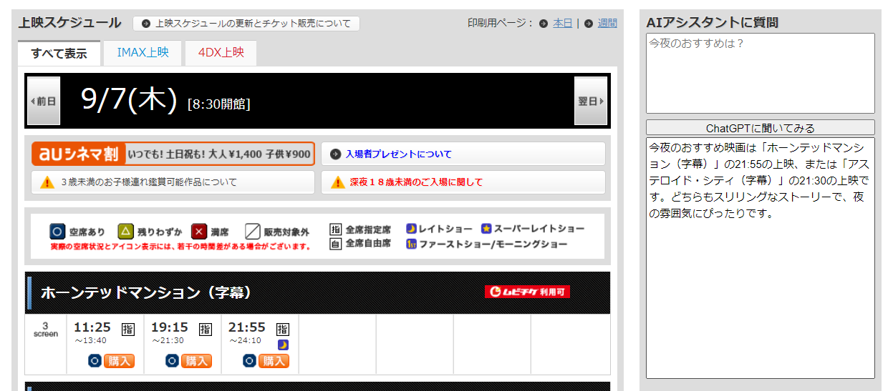

# cinema-chrome-extension

## 概要

ユナイテッドシネマの上映スケジュールページに おすすめ映画質問機能を追加する拡張

## インストール方法

### Chrome ウェブストアからインストールする場合

TBD

### リポジトリからインストールする場合

1. ターミナル上で任意のディレクトリに移動し、`git clone https://github.com/KentoAdachi/cinema-chrome-extension` を使用してこのリポジトリをクローンします。
1. `chrome://extensions/` を開きます。
1. 右上の「デベロッパーモード」をオンにします。
1. 「パッケージ化されていない拡張機能を読み込む」をクリックします。
1. クローンしたリポジトリのディレクトリを選択します。

## 使用方法

1. オプション画面で ChatGPT API Key を設定します。
1. 上部テキストボックスにお勧めしてほしい映画の情報を入力します。
1. 「ChatGPT に聞いてみる」ボタンを押します。
1. 上映スケジュールを元におすすめ映画が表示されます。
